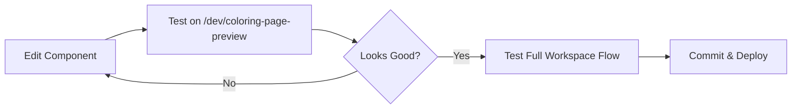
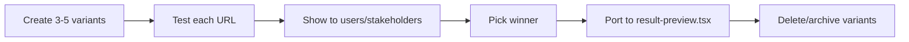

# Isolated Preview Page Development Guide

## Overview
This guide documents how to create and use isolated development pages for rapid UI iteration without backend dependencies.

## What Was Created

### 1. Isolated Development Page
**Location**: `apps/web/app/dev/coloring-page-preview/page.tsx`

**Purpose**: Allows rapid iteration on the post-generation coloring page UI (ResultPreview, timeline, download buttons, edit interface) without:
- Generating actual images
- Database queries
- Authentication
- Worker service running

### 2. Mock API Endpoint
**Location**: `apps/web/app/api/jobs/mock-job-edited-001/versions/route.ts`

**Purpose**: Provides mock version history data for the timeline component to function properly.

---

## How It Was Built

### Step 1: Identify the Production Component
The goal was to isolate the **ResultPreview** component which shows after a coloring page is generated.

**Production location**: `apps/web/components/workspace/result-preview.tsx`

**Production usage**: `apps/web/components/workspace/workspace-right-pane.tsx`

### Step 2: Create Minimal Page Wrapper
```typescript
// apps/web/app/dev/coloring-page-preview/page.tsx
'use client'

import { Card } from '@/components/ui/card'
import { ResultPreview } from '@/components/workspace/result-preview'
import type { Job } from '@coloringpage/types'

// Mock data matching production Job interface
const MOCK_EDITED_JOB: JobWithDownloads = {
  id: 'mock-job-edited-001',
  user_id: 'dev-user',
  status: 'succeeded',
  params_json: {
    complexity: 'simple',
    line_thickness: 'medium',
    edit_parent_id: 'mock-job-original-001', // Critical: makes timeline appear
    edit_prompt: 'Make it more detailed with additional characters'
  },
  created_at: new Date(Date.now() - 60000).toISOString(),
  started_at: new Date(Date.now() - 50000).toISOString(),
  ended_at: new Date(Date.now() - 44000).toISOString(),
  download_urls: {
    edge_map: '/assets/peppa-and-chase-holding-hands.png',
    pdf: '/assets/peppa-and-chase-holding-hands.png'
  }
}
```

### Step 3: Match Production Layout Exactly
```typescript
return (
  <div className="min-h-screen bg-gray-50 py-8">
    <div className="container mx-auto px-4 max-w-4xl">
      {/* EXACT same Card wrapper as production */}
      <Card className="p-4 sm:p-6">
        <h2 className="text-lg sm:text-xl font-semibold mb-4">Your Coloring Page</h2>
        <ResultPreview
          job={MOCK_EDITED_JOB}
          onReset={handleReset}
          onEditJobCreated={handleEditJobCreated}
        />
      </Card>

      {/* Minimal dev note at bottom only */}
      <div className="mt-4 p-3 bg-gray-100 rounded text-xs text-gray-600">
        Dev Mode: Using mock data with timeline history (chicken = original, peppa = edited)
      </div>
    </div>
  </div>
)
```

### Step 4: Create Mock API for Timeline
The `VersionTimeline` component fetches data from `/api/jobs/{jobId}/versions`, so we created a mock endpoint:

```typescript
// apps/web/app/api/jobs/mock-job-edited-001/versions/route.ts
import { NextResponse } from 'next/server'

export async function GET() {
  const mockVersions = {
    total_versions: 2,
    original_job_id: 'mock-job-original-001',
    requested_job_id: 'mock-job-edited-001',
    versions: [
      {
        id: 'mock-job-original-001',
        // ... original version data
        download_urls: {
          edge_map: '/assets/chicken-eating-a-frog.png',
        },
        version_type: 'original',
        version_order: 0
      },
      {
        id: 'mock-job-edited-001',
        // ... edited version data
        download_urls: {
          edge_map: '/assets/peppa-and-chase-holding-hands.png',
        },
        version_type: 'edit',
        edit_prompt: 'Make it more detailed with additional characters',
        version_order: 1
      }
    ],
    metadata: {
      has_edits: true,
      edit_count: 1,
      max_edits: 2
    }
  }

  return NextResponse.json(mockVersions)
}
```

### Step 5: Use Existing Assets
Place test images in `apps/web/public/assets/`:
- `chicken-eating-a-frog.png` (original version)
- `peppa-and-chase-holding-hands.png` (edited version)

---

## Key Principles

### ✅ DO:
1. **Use production components unchanged** - Don't create copies
2. **Match production layout exactly** - Same wrappers, same structure
3. **Use realistic mock data** - Match the actual interfaces/types
4. **Keep dev indicators minimal** - Small note at bottom only
5. **Maintain file structure** - Put in `/dev/` route for isolation

### ❌ DON'T:
1. **Don't add dev controls in the main UI** - No scenario switchers, no debug panels in the flow
2. **Don't create component copies** - Always import from production
3. **Don't modify production code** - Keep changes isolated to `/dev/` and mock APIs
4. **Don't skip the layout wrapper** - Use same Card/Container structure

---

## Recommended AI Design Iteration Workflow

### Phase 1: Design Exploration
When working with AI to iterate on designs for this isolated page:

#### Good Prompt Pattern:
```
I want to redesign the download button section in the coloring page preview.

Current location: The download buttons are rendered by ResultPreview component.
Isolated dev page: http://localhost:3000/dev/coloring-page-preview

Design goals:
1. Make download buttons more prominent
2. Add visual icons that match our playful brand
3. Improve mobile responsiveness

Please:
1. Show me 3 design variations
2. Update ONLY the ResultPreview component
3. Ensure the changes work with our existing timeline/edit interface
4. Keep all functionality intact
```

#### AI Design Iteration Process:
1. **AI generates design concepts** (HTML/CSS mockups or descriptions)
2. **You review and select** preferred direction
3. **AI updates the actual component** (`result-preview.tsx`)
4. **You test on isolated page** (`/dev/coloring-page-preview`)
5. **Iterate** until satisfied
6. **Changes are already in production component** - No porting needed!

### Phase 2: Component-Specific Updates
Target specific sub-sections:

```
Update the "Printing Tips" section in the ResultPreview component:
- Move it to a collapsible accordion
- Add printer icon
- Make tips more kid-friendly

Only modify the "Printing Tips" section (lines 406-414 in result-preview.tsx).
Test on: http://localhost:3000/dev/coloring-page-preview
```

---

## Bringing Changes to Production

### The Beauty: Changes Are Already in Production!

Since the isolated page uses the **actual production components**, any edits made while iterating are already in the production code.

**No porting required** - Just commit and deploy.

### Validation Workflow:



1. **Iterate on isolated page** - Fast feedback loop
2. **Test component in isolation** - Verify design/behavior
3. **Test full workspace flow** - Ensure integration works
4. **Commit changes** - Already production-ready

---

## Code Comments for AI Guidance

### Comprehensive AI Instructions in Dev Page Header

The development page (`apps/web/app/dev/coloring-page-preview/page.tsx`) contains detailed comments at the top explaining:

**Purpose & Capabilities:**
- What the isolated page does
- Why it exists (rapid iteration without backend)
- What mock data it uses

**AI Design Iteration Workflow:**
```
1. Make design changes to: apps/web/components/workspace/result-preview.tsx
2. Test immediately: http://localhost:3000/dev/coloring-page-preview
3. Verify in full app: http://localhost:3000/workspace
4. Commit changes (they're already in production!)
```

**What Can Be Edited:**
- Component styling, layout, interactions
- Download button designs
- Timeline visualization
- Edit interface UI
- Printing tips section
- Any visual/UX elements

**What Must Be Preserved:**
- Component functionality (onClick handlers, state)
- Props structure
- Conditional rendering logic
- Data flow patterns

**Testing Checklist:**
- UI correctness on isolated page
- Timeline toggle functionality
- Version navigation
- Image display
- Edit interface rendering
- Responsive behavior
- Full workspace flow validation

**Why This Approach:**
The production component stays clean and focused. All AI guidance lives in the development page where it belongs. An AI working on this page will immediately see the instructions and understand:
- What they can safely change
- How to test changes
- That changes automatically apply to production
- What to verify before committing

---

## AI Prompting Best Practices

### Effective Prompt Structure:

```
Context:
- Working on: [specific component or section]
- Testing at: http://localhost:3000/dev/coloring-page-preview
- Current state: [describe what exists]

Goal:
[Clear design objective]

Constraints:
- Only edit: [specific file/section]
- Must maintain: [functionality to preserve]
- Don't touch: [areas to avoid]

Request:
[Specific ask - show variations, implement change, etc.]
```

### Example Iteration Prompts:

#### Initial Design Exploration:
```
Context: I'm working on the download button section of the ResultPreview component.
Testing at: http://localhost:3000/dev/coloring-page-preview

Goal: Make the download section more visually appealing and user-friendly for parents.

Show me 3 design variations that:
1. Use playful icons that match our brand (crayons, stars, etc.)
2. Make the primary action (Download Image) more prominent
3. Group secondary actions (Share/Print) more subtly
4. Work well on mobile (current grid is fine, but open to improvements)

Don't implement yet - just show me concepts.
```

#### Specific Implementation:
```
Context: Implementing design variant #2 from our previous discussion.
File: apps/web/components/workspace/result-preview.tsx
Section: Lines 330-387 (Download & Share section)

Update the download section with:
- Large primary "Download PNG" button with download icon
- Secondary "Export PDF" button below it
- Move Share/Print to a subtle "More Options" dropdown
- Add tooltips to explain each action

Keep all existing functionality (onClick handlers, loading states, etc.).
Test on: http://localhost:3000/dev/coloring-page-preview
```

#### Refinement:
```
The download buttons look good, but the loading states need work.

Current issue: The spinner inside the button is too small.
Target: Lines 341-344 (Download Image button loading state)

Make the loading state more visible:
- Larger spinner
- "Downloading..." text should pulse or have animation
- Button should feel "active" during download

Keep the same button size/layout.
```

---

## Creating Design Variants (Multiple UI Explorations)

When you want to explore **multiple completely different designs** before committing to one, create variant pages:

### Variant Workflow:

**Goal**: Try 3-5 different UI designs, pick the best one

**Structure**:
```
apps/web/app/dev/coloring-page-preview/
├── page.tsx               ← Production replica (for tweaking existing design)
├── variant-cards/
│   └── page.tsx          ← Cards layout variant
├── variant-minimal/
│   └── page.tsx          ← Minimal layout variant
└── variant-{your-name}/
    └── page.tsx          ← Your custom variant
```

**URLs**:
```
/dev/coloring-page-preview                  ← Production replica
/dev/coloring-page-preview/variant-cards    ← Cards variant
/dev/coloring-page-preview/variant-minimal  ← Minimal variant
```

### What Can You Change in Variants?

✅ **Everything about layout & design**:
- Complete HTML/JSX structure
- All CSS styling, colors, gradients
- Typography, fonts, sizes
- Layout systems (grid, flexbox, anything)
- Animations and transitions
- Icons, graphics, decorations
- Component arrangement and grouping
- Interactions, hover states

🚫 **What stays the same**:
- Mock data structure (job interface)
- Image URLs (use same test images)
- No backend changes

### Example: Cards Variant

```typescript
// apps/web/app/dev/coloring-page-preview/variant-cards/page.tsx
export default function CardsVariantPage() {
  const job = MOCK_EDITED_JOB

  return (
    <div className="bg-gradient-to-br from-purple-50 to-pink-50">
      {/* 3-column grid - completely different from production */}
      <div className="grid md:grid-cols-3 gap-6">
        <Card className="md:col-span-2">
          {/* Large image card */}
          
        </Card>

        <div>
          {/* Stacked sidebar cards */}
          <Card>Details</Card>
          <Card>Download</Card>
          <Card>Actions</Card>
        </div>
      </div>
    </div>
  )
}
```

### Variant Iteration Process:



### When to Use Variants vs. Direct Editing:

| Use Case | Approach |
|----------|----------|
| Improve existing UI | Edit `result-preview.tsx` directly, test on `/dev/coloring-page-preview` |
| Try multiple designs | Create variants (`variant-cards`, `variant-minimal`, etc.) |
| A/B testing concepts | Create variants, show to users |
| Explore radical changes | Create variants |
| Polish current design | Edit production component |

**See full details**: `docs/DESIGN_VARIANTS_WORKFLOW.md`

---

## Creating Additional Isolated Pages

### Pattern to Follow:

```typescript
// apps/web/app/dev/{feature}-preview/page.tsx
'use client'

import { /* production components */ } from '@/components/...'

// Mock data matching production types
const MOCK_DATA = { /* ... */ }

export default function {Feature}PreviewDevPage() {
  // Mock handlers (console.log for dev)
  const handleAction = () => console.log('[DEV] Action triggered')

  return (
    <div className="min-h-screen bg-gray-50 py-8">
      <div className="container mx-auto px-4 max-w-4xl">
        {/* EXACT production layout wrapper */}
        <Card className="p-4 sm:p-6">
          <h2>Your {Feature}</h2>

          {/* Production component with mock data */}
          <ProductionComponent
            data={MOCK_DATA}
            onAction={handleAction}
          />
        </Card>

        {/* Minimal dev note */}
        <div className="mt-4 p-3 bg-gray-100 rounded text-xs text-gray-600">
          Dev Mode: Using mock data for {feature}
        </div>
      </div>
    </div>
  )
}
```

### Examples to Create:

1. **Upload Interface Preview**: `app/dev/upload-preview/page.tsx`
   - Mock: FileUploader component
   - Test: drag-drop, validation, previews

2. **Generation Progress Preview**: `app/dev/generation-progress-preview/page.tsx`
   - Mock: GenerationProgress component
   - Test: loading states, animations, error handling

3. **Edit Interface Preview**: `app/dev/edit-interface-preview/page.tsx`
   - Mock: EditInterface component
   - Test: form validation, credit display, prompt suggestions

---

## Testing Checklist

Before committing changes made on isolated pages:

- [ ] Component renders correctly on isolated page
- [ ] All interactions work (clicks, forms, etc.)
- [ ] Loading states display properly
- [ ] Error states handle gracefully
- [ ] Responsive on mobile (resize browser)
- [ ] Test full workspace flow: `/workspace`
  - [ ] Upload image → generate → view result
  - [ ] Text prompt → generate → view result
  - [ ] Edit an existing page
  - [ ] Timeline navigation works
- [ ] No console errors
- [ ] All TypeScript types are correct

---

## Troubleshooting

### Issue: "Component not found" error
**Fix**: Ensure import paths use `@/components/...` aliases

### Issue: Timeline doesn't appear
**Fix**: Mock job must have `edit_parent_id` in `params_json`

### Issue: Images don't load
**Fix**: Verify images exist in `apps/web/public/assets/`

### Issue: API returns 404 for versions
**Fix**: Create mock endpoint at `app/api/jobs/{mock-job-id}/versions/route.ts`

---

## Summary

### The Power of This Approach:

1. **Zero Context Switching**: Edit real components, see results immediately
2. **No Porting Needed**: Changes are already in production code
3. **Fast Iteration**: No backend dependencies = instant feedback
4. **AI-Friendly**: Clear boundaries, focused context, easy to prompt
5. **Safe Experimentation**: Isolated route won't affect production users

### When to Use:

- Designing new UI sections
- Refining existing components
- Testing responsive layouts
- Experimenting with interactions
- A/B testing design concepts

### When NOT to Use:

- Backend logic changes
- Database schema updates
- API endpoint modifications
- Complex state management rewrites

Use isolated pages for **visual and interaction design iteration**, then test integration in the full workspace flow before deploying.
