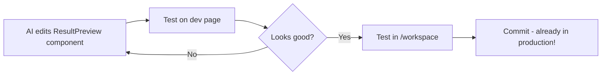

# Isolated Development Page - Quick Summary

## What Was Created

✅ **Dev Page**: `apps/web/app/dev/coloring-page-preview/page.tsx`
- Production-identical UI with mock data
- Full timeline functionality (2 versions)
- No auth, no backend, instant iteration

✅ **Mock API**: `apps/web/app/api/jobs/mock-job-edited-001/versions/route.ts`
- Returns 2-version history for timeline
- Original: chicken-eating-a-frog.png
- Edited: peppa-and-chase-holding-hands.png

✅ **Documentation**: `docs/DEV_ISOLATED_PREVIEW_PAGE_GUIDE.md`
- Complete guide on how it works
- AI prompting patterns
- Iteration workflow

## How to Use

### Access
```
http://localhost:3000/dev/coloring-page-preview
```

### Workflow for AI Design Iteration



**Key Point**: You edit the ACTUAL production component. No porting needed.

### Files to Edit
- **Component**: `apps/web/components/workspace/result-preview.tsx`
- **Test URL**: `http://localhost:3000/dev/coloring-page-preview`
- **Verify**: `http://localhost:3000/workspace` (full flow)

## Why This Approach

| Old Way | New Way |
|---------|---------|
| Create mockup → Implement → Test with backend → Debug → Deploy | Edit component → Test instantly → Done |
| Need images generated | Use static images |
| Need auth/database | Zero dependencies |
| Changes in separate mockup file | Changes already in production code |
| Port changes back to prod | No porting step! |

## AI Instructions Location

**All AI guidance is in the DEV page header**, not production code:
- Open `apps/web/app/dev/coloring-page-preview/page.tsx`
- Read the 45-line comment block at the top
- Contains: purpose, workflow, what to edit, what to preserve, testing checklist

**Production component stays clean** - no AI comments cluttering the code.

## Example AI Prompts

### Design Exploration
```
I want to redesign the download button section.

Context:
- Component: apps/web/components/workspace/result-preview.tsx
- Testing: http://localhost:3000/dev/coloring-page-preview

Show me 3 variations that make the buttons more playful and prominent.
Don't implement yet - just show concepts.
```

### Implementation
```
Implement variant #2 from our discussion.

File: apps/web/components/workspace/result-preview.tsx
Section: Download & Share (around line 330)

Make the primary "Download Image" button larger with a playful icon.
Keep all onClick handlers and loading states intact.
```

### Refinement
```
The spinner in the download button is too small.

Target: Line 342-344 (Download Image button loading state)

Make it more visible - larger spinner, animated text.
```

## What's Next

Create more isolated pages for other components:
- Upload interface
- Generation progress
- Edit interface
- Parameter controls

Same pattern:
1. Create `apps/web/app/dev/{feature}-preview/page.tsx`
2. Import production component
3. Add mock data
4. Add AI instructions in header comment
5. Test URL in comments

## Key Files Reference

```
ColoringGenerator/
├── apps/web/
│   ├── app/dev/coloring-page-preview/
│   │   ├── page.tsx                           ← Base (uses production ResultPreview)
│   │   ├── variant-cards/
│   │   │   └── page.tsx                       ← Custom redesign variant
│   │   └── variant-minimal/
│   │       └── page.tsx                       ← Custom redesign variant
│   ├── app/api/jobs/mock-job-edited-001/versions/
│   │   └── route.ts                           ← Mock API for timeline
│   └── components/workspace/
│       └── result-preview.tsx                 ← Production component (edit this)
├── docs/
│   ├── DEV_ISOLATED_PREVIEW_PAGE_GUIDE.md     ← Full guide
│   ├── DESIGN_VARIANTS_WORKFLOW.md            ← Variants guide
│   └── ISOLATED_DEV_PAGE_SUMMARY.md           ← This file
└── public/assets/
    ├── chicken-eating-a-frog.png              ← Original version
    └── peppa-and-chase-holding-hands.png      ← Edited version
```

## Remember

🎯 **The magic**: Edit production code, test instantly, no porting.
📝 **Instructions**: In dev page header only, not production.
✅ **Always verify**: Test on dev page → Test in workspace → Commit.
